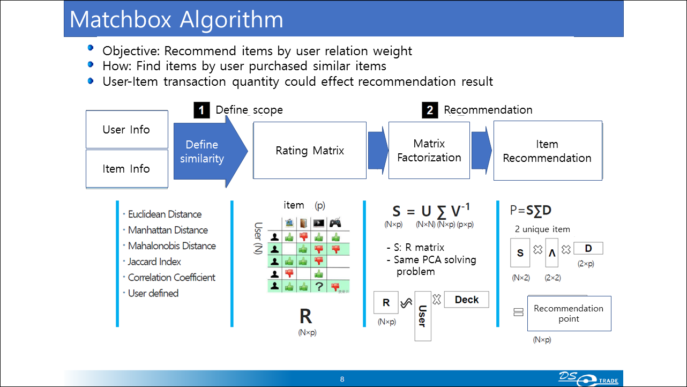
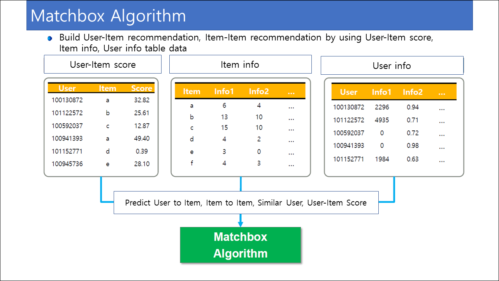
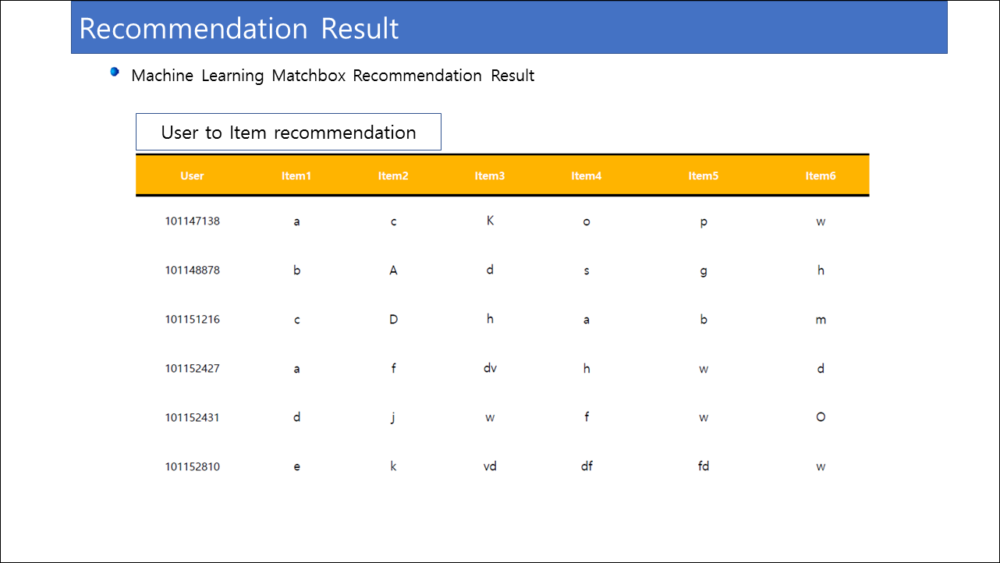
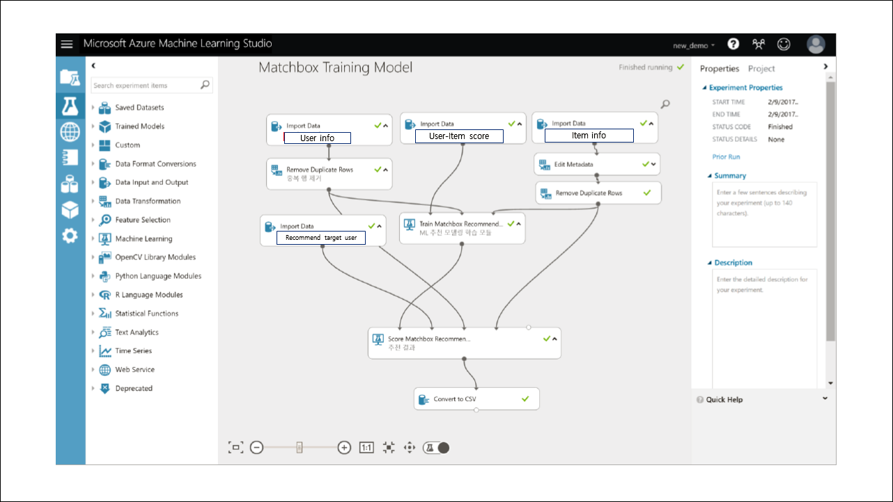

# HNN Project Azure Machine Learning - Matchbox
This repositoy is developed in HNN Project hackfest

## About Matchbox
The matchbox algorithm using Azure Machine Learning's recommendation module is also applicable to recommendation services and is used in various social media sites, most types of e-commerce sites, and sponsor search results of search engines.  
In particular, Azure Machine Learning provides a PaaS-based service which allows developers to reliably provide recommendation services without consideration of any infrastructure. In addition, it can be easily distributed recommendation models using the Restful API, and possible to execute batch training by Azure function app.  

  
  
  
  

Matchbox is basically a system that recommends items with high similarity based on the items the user has. The degree of similarity is derived based on the score(point) per transaction in which the user purchased the item. More the purchased information, the higher the accuracy of recommendation results.  

## Matchbox data
The Matchbox algorithm should basically provide the following three data:  
- Item Information  
- User Information  
- User-Item Score Information  

## Matchbox scoring
Scoring is very important for accuracy in Matchbox. In other words, we need to determine which information should be weighted to increase similarity and reflection. For example, if a recommendation is made for a real estate service business, an additional variety of features are created and used for this score information. Instead of simply using customer information,  
- Visits recently  
- Added favorite items  
- Actions taken per visit (view apartment size information, view traffic information)  
  
It is important to use this variety of information to create a score.  

## Feature control
While RFM is a common practice, it can be difficult to determine which features to weight among the hundreds of different and complex features. In this case, PCA analysis techniques can be considered.  
Principal component analysis - scoring = PCA method = where weights are given here  
[Principal component analysis](https://en.wikipedia.org/wiki/Principal_component_analysis)  

## Matchbox model implementation
The matchbox models we have reviewed to implement in hackfest are below. It is easy to apply due to the good tutorial and the good data set. In case of Hogangnono, has used several interpolation methods to upload actual data to the matchbox, and continue to apply the above consideration issues and additional data collection know-how learned during the hackfest.  

[Matchbox Tutorial](https://gallery.cortanaintelligence.com/Tutorial/8-Recommendation-System-1)  

[Movie matchbox](https://gallery.cortanaintelligence.com/Experiment/Recommender-Movie-recommendation-3)  

[Restaurant rating matchbox](https://gallery.cortanaintelligence.com/Experiment/Recommender-Restaurant-ratings-2)  
 